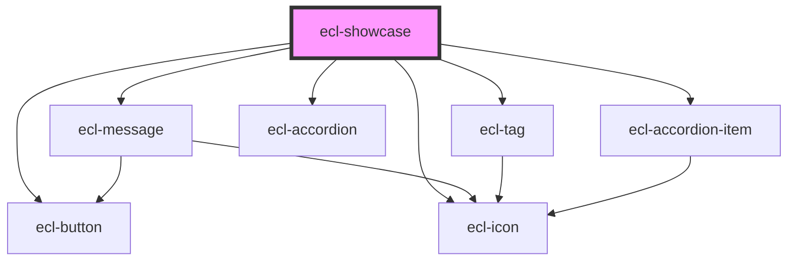

# ecl-showcase

<!-- Auto Generated Below -->

## Dependencies

### Depends on

- [ecl-button](../ecl-button)
- [ecl-icon](../ecl-icon)
- [ecl-message](../ecl-message)
- [ecl-tag](../ecl-tag)
- [ecl-accordion](../ecl-accordion)
- [ecl-accordion-item](../ecl-accordion)

### Graph

----------------------------------------------

*Built with [StencilJS](https://stenciljs.com/)*
